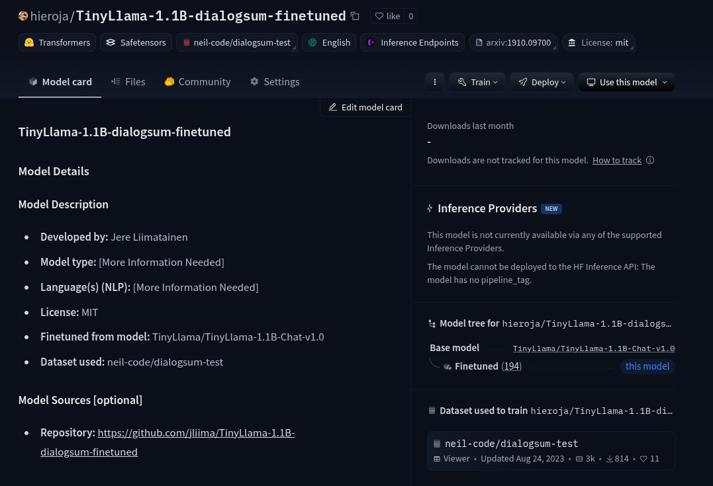
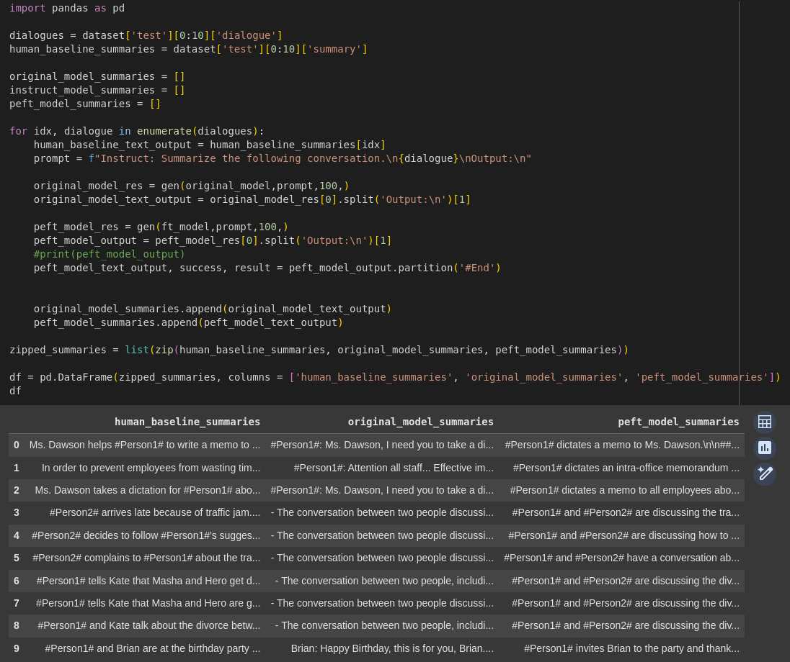
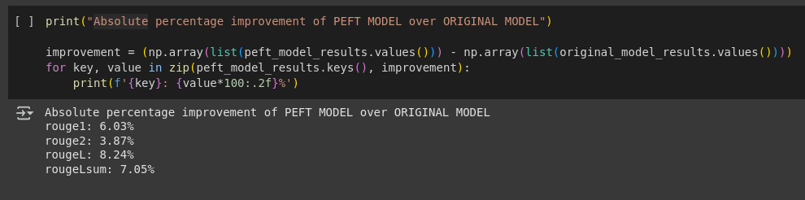

# TinyLlama-1.1B-dialogsum-finetuned
## Introduction

This is done as a school assignment. The included notebook is copy of:
https://www.kaggle.com/code/maliksami007/fine-tuning-phi-2-sami.

This was used as a base for the project.

Github: 

https://github.com/jliima/TinyLlama-1.1B-dialogsum-finetuned 

Resulting model can be found in: 

https://huggingface.co/hieroja/TinyLlama-1.1B-dialogsum-finetuned 

## Changes made
The following changes have been made:
- Model that was trained changed from `microsoft/phi-2` to `TinyLlama/TinyLlama-1.1B-Chat-v1.0`
- Model fine-tuning settings changed:
  - `max_steps` = 500
  - `logging_steps` = 50
  - `eval_steps` = 50
  - `save_steps` = 50
- Some missing pip installations were added.
- Folder structures changed to work in Google collab environment.
- Hugging Face upload url was changed to reflect me (hieroja) as author.

## Screenshots

(Answer to assignment step 14.)

### Uploaded model

### Sample outputs

### Analysis

On average, the improvements hover around 6–7 percentage points across these metrics. This indicates that the PEFT model has made a substantial enhancement over the original model, leading to more accurate and coherent outputs as measured by these ROUGE scores.

